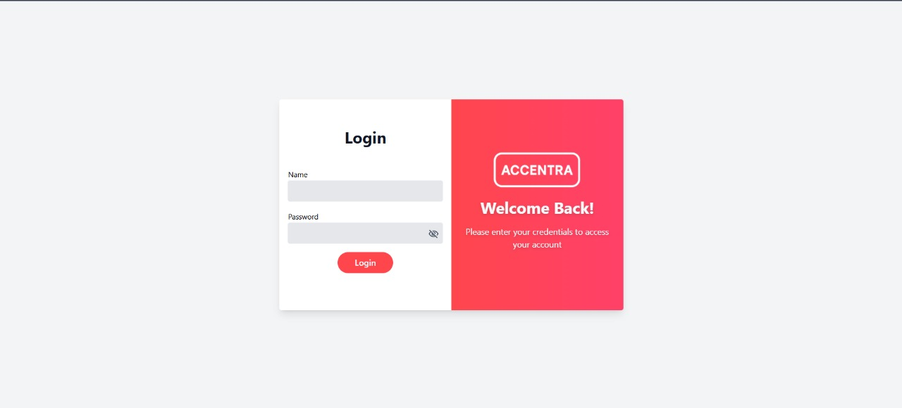
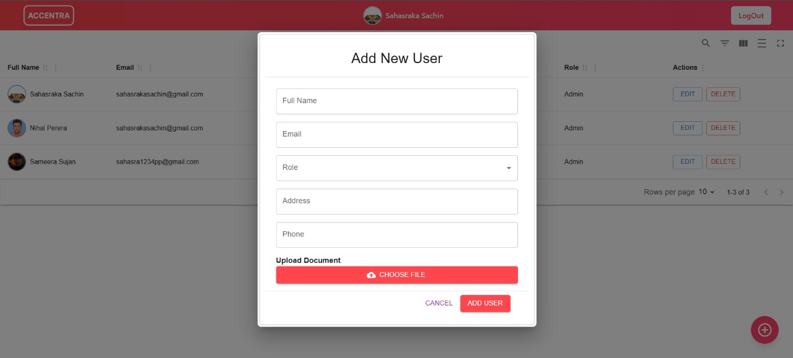
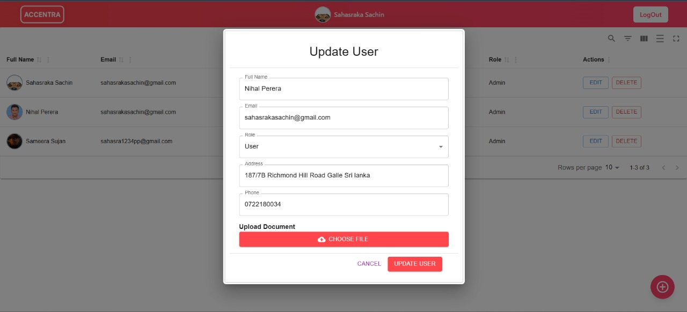
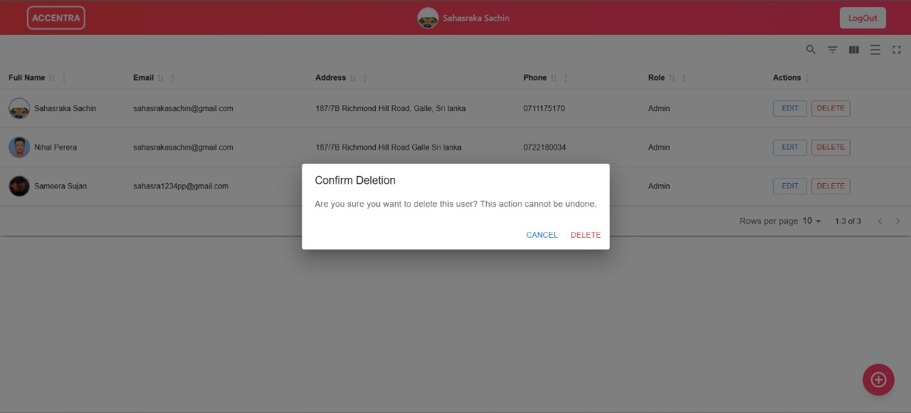
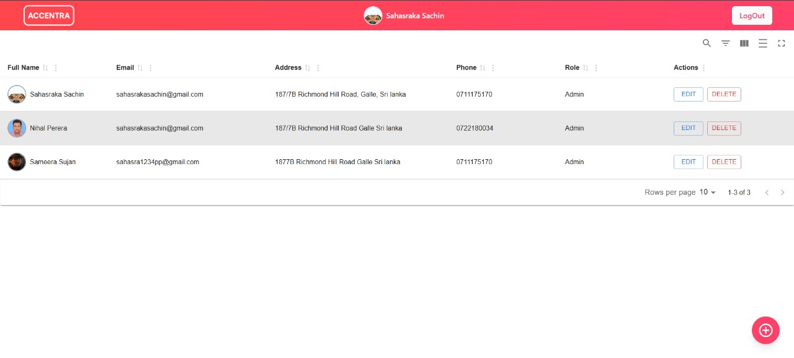
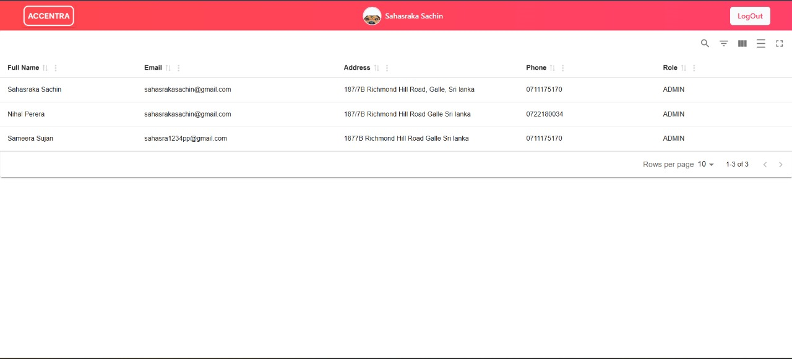

# 🌐 User Management System (Spring Boot + React)

A **modern full-stack user management system** built with **Spring Boot** (backend) and **React + Vite** (frontend).
This application provides **JWT-based authentication**, **role-based access control**, **file uploads via MinIO**, and **email notifications** for newly created users.

---

## 🧩 Project Structure

```
📦 user-management
├── user-management-backend   # Spring Boot REST API (Java)
└── user-management-frontend  # React + Vite + TypeScript (Admin UI)
```

### ⚙️ Backend

* **Framework:** Spring Boot `3.5.7`
* **Java version:** `17` (upgrade-ready for Java 21)
* **Core features:** JWT Auth · CRUD · MinIO Integration · Mail Service

### 💻 Frontend

* **Framework:** React + Vite
* **UI Library:** Material UI (MUI)
* **Features:** Admin dashboard, modals for Add/Edit/Delete, token-based session handling

---

## 🚀 Features

✅ Secure **JWT authentication** (login returns user + token)
✅ **Admin-only** CRUD operations for user management
✅ **File/Image uploads** stored in MinIO object storage
✅ **Email notifications** with randomly generated passwords
✅ **Material UI frontend** with responsive design and confirmation dialogs

---

## 🧱 Architecture Overview

### 🧠 Backend (Spring Boot)

| Layer           | Description                           | Example Files                                                |
| --------------- | ------------------------------------- | ------------------------------------------------------------ |
| **Controller**  | Handles API endpoints                 | `AuthController.java`, `UserController.java`                 |
| **Service**     | Business logic layer                  | `UserService.java`, `EmailService.java`, `MinioService.java` |
| **Model / DTO** | Data representation                   | `UserModel.java`, `UserDTO.java`                             |
| **Repository**  | Database operations                   | `UserRepo.java`                                              |
| **Security**    | Authentication & authorization        | `SecurityConfig.java`, `JwtAuthFilter.java`                  |
| **Config**      | App configuration (CORS, MinIO, etc.) | `WebConfig.java`, `application.yaml`                         |

### 🎨 Frontend (React + Vite)

| Folder           | Description                                             |
| ---------------- | ------------------------------------------------------- |
| `src/pages`      | Page-level views (`Login.tsx`, `Admin.tsx`, `User.tsx`) |
| `src/components` | Reusable UI (Table, Add/Edit Dialogs, Upload fields)    |
| `src/api`        | Axios-based API requests                                |
| `src/main.tsx`   | App entry point                                         |

---

## 🧪 API Endpoints

**Base Path:** `/api/v1`

| Method   | Endpoint                  | Description                                |
| -------- | ------------------------- | ------------------------------------------ |
| `POST`   | `/login`                  | Authenticate user and return JWT token     |
| `GET`    | `/getusers`               | Retrieve all users                         |
| `GET`    | `/admin/getuserbyid/{id}` | Get single user by ID                      |
| `POST`   | `/admin/createuser`       | Create new user (multipart/form-data)      |
| `PUT`    | `/admin/updateuser`       | Update existing user (multipart/form-data) |
| `DELETE` | `/admin/deleteuser/{id}`  | Delete a user                              |

**Headers:**
`Authorization: Bearer <JWT_TOKEN>`

---

## 🧰 Setup Instructions

### 🔧 Backend Setup

**Requirements:**

* JDK 17+
* Maven (`mvnw` included)
* Running MinIO and SMTP service

```bash
cd user-management-backend
./mvnw spring-boot:run
```

Or build and run:

```bash
./mvnw clean package -DskipTests
java -jar target/*.jar
```

🧾 **Configuration:**
Edit `src/main/resources/application.yaml` for:

* Database credentials
* MinIO access keys
* Mail sender credentials
* JWT secret

---

### 🧰 Run MinIO for development (Docker)

If you don't have a MinIO instance available, run a local MinIO server with Docker for development. Below are two simple options: a single docker run command and a docker-compose example.

Quick Docker (Windows PowerShell example):

```powershell
# create local folders for persistence (adjust paths as needed)
New-Item -ItemType Directory -Path C:\minio\data -Force | Out-Null
New-Item -ItemType Directory -Path C:\minio\config -Force | Out-Null

docker run -d `
  -p 9000:9000 `
  -p 9001:9001 `
  --name minio `
  -e MINIO_ROOT_USER=minioadmin `
  -e MINIO_ROOT_PASSWORD=minioadmin `
  -v C:\minio\data:/data `
  -v C:\minio\config:/root/.minio `
  minio/minio:latest server /data --console-address ":9001"
```

Now the MinIO server is available at `http://localhost:9000` and the web console at `http://localhost:9001` (login with `minioadmin:minioadmin`).

Docker Compose (recommended): create a `docker-compose.yml` with the following content and run `docker compose up -d`:

```yaml
version: '3.8'
services:
  minio:
    image: minio/minio:latest
    container_name: minio
    ports:
      - '9000:9000'
      - '9001:9001'
    environment:
      MINIO_ROOT_USER: minioadmin
      MINIO_ROOT_PASSWORD: minioadmin
    volumes:
      - ./minio/data:/data
      - ./minio/config:/root/.minio
    command: server /data --console-address ":9001"

# After startup, create a bucket (e.g., 'users') via the web console or mc CLI.
```

Configure your backend `application.yaml` to point at the dev MinIO instance, for example:

```yaml
minio:
  url: http://localhost:9000
  access-key: minioadmin
  secret-key: minioadmin
  bucket: users
```

Make sure the bucket (`users` above) exists. You can create it via the MinIO Console or the `mc` CLI.


### 💡 Frontend Setup

**Requirements:**
Node.js 18+ and npm

```bash
cd user-management-frontend
npm install
npm run dev
```

The app will start at **[http://localhost:5173](http://localhost:5173)** (by default).

---

## 🪶 Screenshots

|                    Login                   |
| :--------------------------------------------: |
|  |

|                      Add User                     |                      Update User                     |                      Delete User                     |
| :-----------------------------------------------: | :--------------------------------------------------: | :--------------------------------------------------: |
|  |  |  |

|                   Admin Dashboard                   |                  User View                 |
| :---------------------------------------: | :----------------------------------------------: |
|  |  |


---

## 🔐 Environment Variables

| Key                                                                 | Description         |
| ------------------------------------------------------------------- | ------------------- |
| `MINIO_URL`, `MINIO_ACCESS_KEY`, `MINIO_SECRET_KEY`, `MINIO_BUCKET` | MinIO configuration |
| `MAIL_HOST`, `MAIL_PORT`, `MAIL_USERNAME`, `MAIL_PASSWORD`          | SMTP credentials    |
| `JWT_SECRET`                                                        | JWT signing key     |

---

## 🧭 Development Tips

* Check **CORS** configuration in `WebConfig.java` if the frontend can’t reach the backend.
* MinIO upload issues? Verify endpoint and bucket exist.
* For generated passwords, backend uses `PasswordGenerator.generateSecurePassword(12)` and emails them to users.
* To upgrade to **Java 21**, edit:

  ```xml
  <java.version>21</java.version>
  ```

  in `pom.xml` and rebuild.

---

## 🧑‍💻 Contributing

1. Fork the repository
2. Create a feature branch
3. Commit changes (`feat: add edit user dialog`)
4. Push and open a PR

Follow Java and TypeScript linting standards.

---

## 📬 Contact

**Author:** [hello-sahasraka](https://github.com/hello-sahasraka)
For inquiries, reach out via GitHub or project email.

